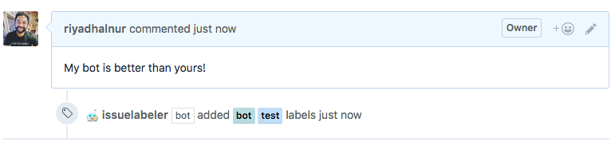

# issuelabeler  

  

> A GitHub bot to label issues automatically based on title and body against explicit label mappings. Built with [probot](https://github.com/probot/probot).  

  

### Installation  
After installation, create `.github/labeler.yml` in the default branch to enable it:

```yml
# Explicit key word mappings to labels
titleMappings: 
    WIP: WIP
    NoSquash: NoSquash

# Explicit target branch name mappings to labels
branchMappings:
    master: BASE
    customer-ABC: CUSTOMER-ABC
    feature-XYZ: FEATURE-XYZ
```  

### Contributing  
Read the [CONTRIBUTING](CONTRIBUTING.md) guide for information.  

### License  
Licensed under MIT. See [LICENSE](LICENSE) for more information.  

Logo built using [Streamline Emoji](http://emoji.streamlineicons.com) by [@webalys](https://twitter.com/webalys) under the Creative Common Attribution licence.  

### Issues  
Report a bug in [issues](https://github.com/riyadhalnur/issuelabeler/issues).   

Made with love in Kuala Lumpur, Malaysia by [Riyadh Al Nur](https://verticalaxisbd.com)  
